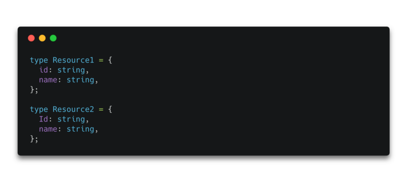
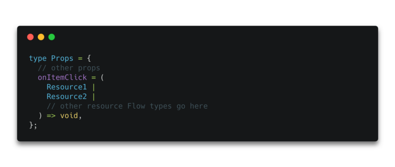
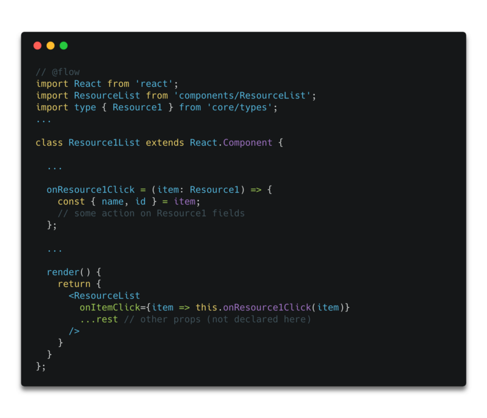
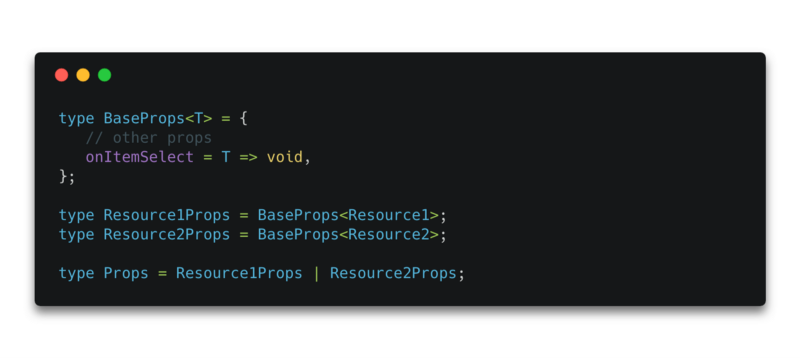

_This post is part of an informal series of small articles focusing on Flow types usages that I’ve discovered and found useful over the past few months. The first article of this series can be found_ [_here_](https://medium.com/@MaximeHeckel/how-to-efficiently-type-your-styled-components-with-flow-f43930a0dd2b)_._

Building generic React components can be a great way to simplify the codebase of a project. By combining overlapping functionalities into a single component, we reduce the entropy of components and thus reduce the amount of testing needed. However, typing generic React components can be a bit of hassle at first, especially when you‘re just getting started with Flow. This post will focus on one example of a generic React component that I was struggling to type a few months ago, and how Flow generics helped me to not only overcome the typing issues but also to build a scalable type for this component.

### From multiple typed components to one

In the project I was working on, I had to handle multiple resources (named here `Resource1`, `Resource2`, `Resource3`, … for simplicity). Each resource had its own associated`List` component (`Resource1List`, `Resource2List`, …), each of which was pretty similar to the others in terms of implementation, as the resources themselves were quite the same outside of a few differences. Below, you can see the types of `Resource1` and `Resource2` :

So given these specs, I wanted to build a single `ResourceList` component to display items of a given resource. Its props would include an `onItemClick` callback function, which takes a variable of that resource type as an argument. Here’s the first type that I wrote for the props of the `ResourceList` component:

Now that the component is typed, the next step consists of trying to use it with one of our Resources. Here’s how `ResourceList` can be used for `Resource1` for example:

This is the moment when I ran into the main problem. Given the way I typed this component, running Flow against the code in the example above outputs an error:

In the Resource types we declared above ( `Resource1`, `Resource2` , …), you can see that the key of the “id” field of each Resource doesn’t match. Thus, whenever we will use this component and write an `onItemClick` function for a resource, Flow will give you an error telling us the properties of the other resources are missing.

### How to use generics

To overcome this kind of situation, generics can be very practical. This is how we can end up typing this component and fix this issue:

- we can provide a generic `BaseProps` type which takes a generic type `T`
- use `T` inside `BaseProps` for our`onItemClick` function which will take an item of type `T` as argument and thus be of type `T => void`
- declare `Resource1Props` , `Resource2Props` , etc, based on `BaseProps`
- write the type `Props` as an enum of `Resource1Props`, `Resource2Props`, etc.

The resulting code looks like this:

Running Flow with this type should output the following:

We have now typed our generic list component properly thanks to Flow. We can see that using generics not only brings flexibility to our type, but also will help in the future when we want to scale up the usage of this component, so it can be used with even more resources.

#### If you liked this article don’t forget to hit the “clap” button and if you have any other questions I’m always reachable on [Twitter](http://twitter.com/MaximeHeckel), or on my [website](https://maximeheckel.com). You can also subscribe to my [Medium publication](https://medium.com/maxime-heckel) to not miss my next post.

Have a wonderful day.  
Maxime
