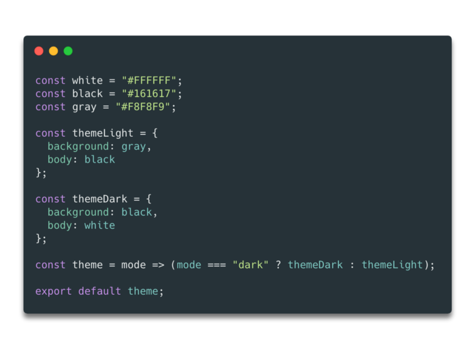
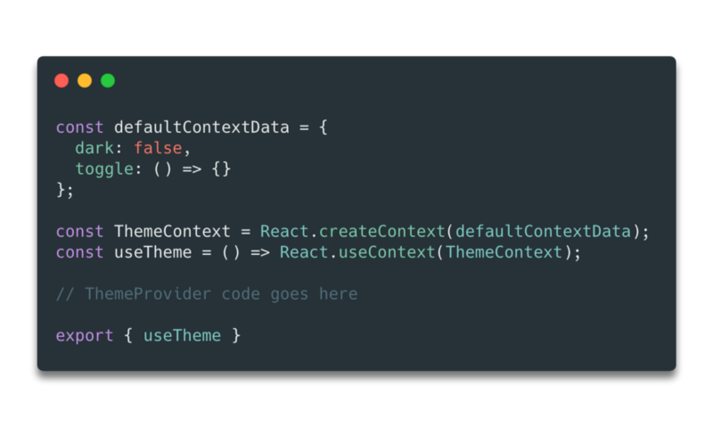
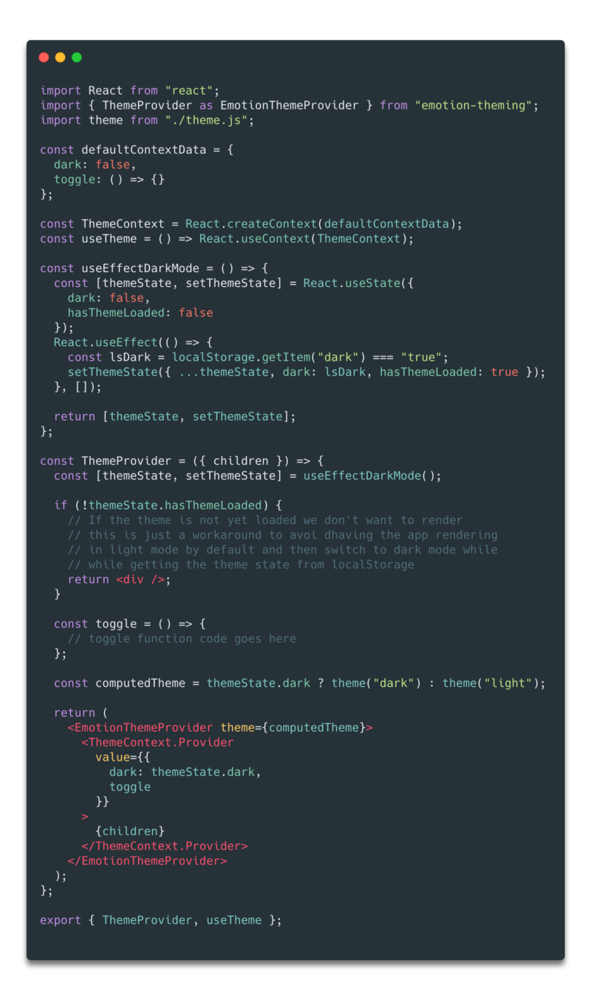
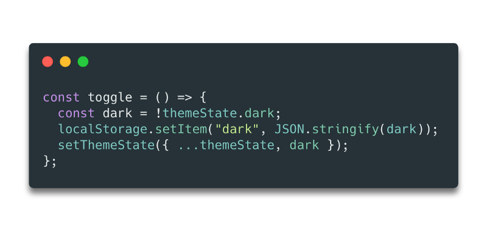
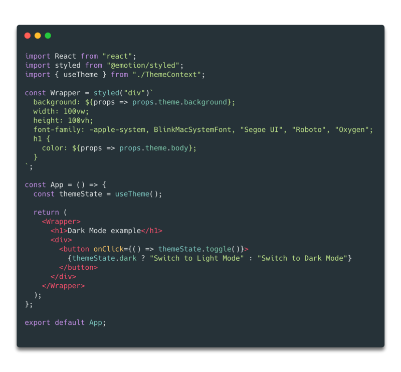

import ColoredBlock from '../src/components/ColoredBlock';

Since the release of macOS Mojave, a lot of people have expressed their love for dark mode and a lot of websites like Twitter, Reddit or Youtube have followed this trend. Why you may ask? I think the following quote from [this Reddit post](https://www.reddit.com/r/apple/comments/4odg6w/why_do_people_want_dark_mode_so_badly/) summarizes it pretty well:

> Night is dark. Screen is bright. Eyes hurt.   
> Night is dark. Screen is dark. Eyes not hurt.

As I want to see even more websites have this feature, I started experimenting with an easy a non-intrusive way to add a dark mode to my React projects, and this is what this article is about.   
In this post, I’m going to share with you how I built dark mode support for a sample React app with Emotion themes. We’ll use a combination of contexts, hooks, and themes to build this feature and the resulting implementation should not cause any fundamental changes to the app.

_Note: I use Emotion as a preference, but you can obviously use CSS modules or even inlines styles to implement a similar feature._

<ColoredBlock color="#FED5D7">

**What we’re going to build:**

The objective here is to have a functional dark mode on a website with the following features:

- a **switch** to be able to enable or disable the dark mode
- some **local storage** support to know on load if the dark mode is activated or not
- a **dark** and **light** theme for our styled components to consume

</ColoredBlock>

### Theme definitions

The first thing we will need for our dark mode is a definition of what it stands for color-wise. Emotion themes are very well adapted to do this. Indeed we can define all our dark mode colors and light mode colors in distinct files for example and have these colors use the same keys to be accessed. Below we can see an example of a theme I’m using in one of my projects and its dark equivalent.

You’ll notice in the code above that I gave very descriptive names to my variables such as **background** or **body**. I always try to make sure none of the variables names are based on the color so I can use the same name across the different themes I’m using.

Now that we have both our dark and light theme, we can focus on how we’re going to consume these themes.

### Theme Provider

This is the core component of this post. The Theme Provider will contain all the logic for our dark mode feature: the toggle function, which theme to load when your site renders the first time, and also, inject the theme to all your child components.  
With the help of React Hooks and Context, it is possible with just a few lines of code and without the need to build any classes or HoC (Higher order Components).

#### Loading the state in Context

First, we need to define a default state for our Theme Provider. The two elements that define these states are:

- a boolean that tells us whether or not the dark theme is activated, defaults to `false`.
- a function **toggle** that will be defined later.

This state will be the default state in a **ThemeContext**, because we want to have access to these items across our all application. In order to avoid having to wrap any page of our app in a **ThemeContext.Consumer**, we’ll build a custom **useTheme** hook based on the useContext hook. Why hooks? I think this tweet summarizes it pretty well:

As it is stated in the tweet above, I really believe that hooks are more readable than render props:

In this ThemeProvider component, we’ll inject both the correct theme and the toggle function to the whole app. Additionally, it will contain the logic to load the proper theme when rendering the app. That logic will be contained within a **custom hook**: **useEffectDarkMode**.

In the code above, we take advantage of both the useState and useEffect hook. The useEffectDarkMode Hook will set a local state, which is our theme state when mounting the app. Notice that we pass an empty array `[]` as the second argument of the useEffect hook. Doing this makes sure that we only call this useEffect when the ThemeProvider component mounts (otherwise it would be called on every render of ThemeProvider).

The code snippet above contains the (almost) full implementation of our **ThemeProvider:**

- **If dark is set to true in localStorage**, we update the state to reflect this and the theme that will be passed to our Emotion Theme Provider will be the dark one. As a result, all our styled component using this theme will render in **dark mode**.
- **Else**, we’ll keep the default state which means that the app will render in **light mode**.

The only missing piece in our implementation is the toggle function. Based on our use case, it will have to do the following things:

- reverse the theme and update the themeState
- update the **dark** key in the localStorage

### Adding the theme switcher

In the previous part, we’ve implemented all the logic and components needed, now it’s time to use them on our app!  
Since we’ve based our implementation on React Context, we can simply import the **ThemeProvider** and wrap our application within it.

The next step is to provide a button on the UI to enable or disable the dark mode. Luckily, we have access to all the things we need to do so through the **useTheme hook,** which will give us access to what we’ve passed to our **ThemeContext.Provider** in part two of this post.

Considering we’re in the default state (light mode), clicking this button will call the toggle function provided through the **ThemeContext** which will set the local storage variable dark to true and the themeState dark variable to true. This will switch the theme that is passed in the Emotion Theme Provider from light to dark. As a result, all our styled components using that theme will end up using the dark theme, and thus our entire application is now in dark mode.   
In the example above, the **Wrapper component** uses the colors of the theme for the fonts and the background, when switching from light to dark these CSS properties will change and hence the background will go from gray to black and the font from black to white.

### Conclusion

We successfully added support for dark mode in our React application without having done any fundamental changes! I really hope this post will inspire others to add this feature to their own website or app in order to make them more easy on the eye when used during night time.  
Moreover, this kind of feature is a great example of hook implementations and how to use the latest features of React to build amazing things.  
I got this feature on my own website/portfolio and this is how it looks:

The dark mode implementation on my website (sorry for the low frame rate 😅).

If you want to get a sample project with dark mode to hack on top of it, check out [this minimal React app](https://github.com/MaximeHeckel/react-hook-context-emotion-dark-mode) I built with all the code showcased on this article.

<ColoredBlock color="#FEE7DA">

#### If you liked this article don’t forget to hit the “clap” button and if you have any other questions I’m always reachable on [Twitter](http://twitter.com/MaximeHeckel), or on my [website](https://maximeheckel.com). You can also subscribe to my [Medium publication](https://medium.com/maxime-heckel) to not miss my next post.

Have a wonderful day.  
Maxime

</ColoredBlock>
