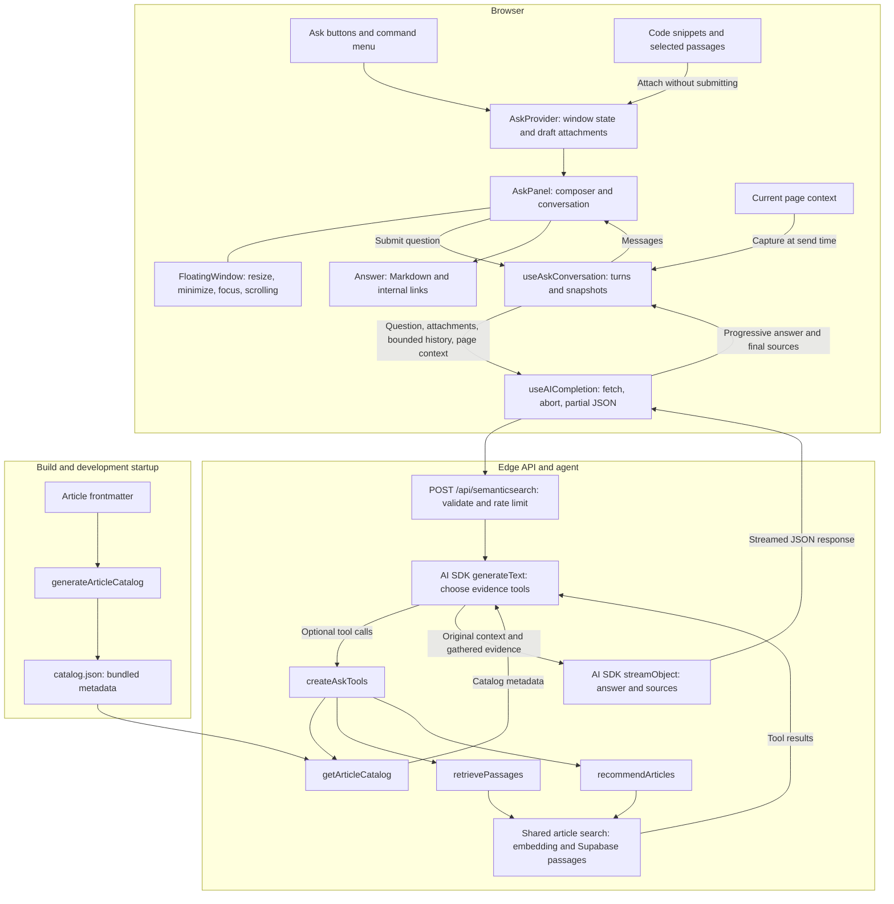

# Ask: floating conversation architecture

Ask is a persistent frontend conversation backed by an Edge API and AI SDK tools. The window controls presentation; conversation state, transport, and server-side evidence gathering have separate owners.

## Frontend responsibilities

- [`AskProvider`](../../core/components/Ask/AskContext.tsx) lives above page routes in [`_app.tsx`](../../pages/_app.tsx). It lazily mounts the panel, owns open/minimized/closed state and unsent attachments, and requests composer focus. Code and selection actions attach content without submitting a question.
- [`AskPanel`](../../core/components/Ask/AskPanel.tsx) owns the draft text and renders attachment pills, messages, activity status, cancellation, and new-conversation controls.
- [`FloatingWindow`](../../core/components/FloatingWindow/index.tsx) handles presentation and interaction. [`FloatingAnchor`](../../core/components/FloatingAnchor/index.tsx) handles the minimized draggable control. [`useVerticalResize`](../../core/components/FloatingWindow/useVerticalResize.ts) constrains resizing to the visible viewport, including the mobile keyboard.
- [`useAskConversation`](../../core/components/Ask/useAskConversation.ts) owns completed turns and the current turn's attachment/page snapshots. At send time, it captures the current page and bounds the history sent to the server.
- [`useAICompletion`](../../core/components/Ask/useAICompletion.ts) owns the request, abort controller, streaming status, partial JSON parsing, and errors. It publishes answer text progressively and sources when the response completes.
- [`Answer`](../../core/components/Ask/Answer.tsx) compiles Markdown for display. [`AnswerLink`](../../core/components/Ask/AnswerLink.tsx) uses Next.js navigation for internal links so changing articles preserves the mounted conversation.

Closing or minimizing preserves the draft and conversation in memory. Starting a new conversation resets them and cancels the active request. Reloading the page loses that state; there is no persisted conversation store. Stopping generation preserves the partial answer, and stale requests cannot overwrite a newer turn.

## Page context and history

[`captureAskPageContext`](../../lib/askPageContext.ts) reads the page when a question is sent, not when Ask first opens:

| Page         | Context sent                                                                          |
| ------------ | ------------------------------------------------------------------------------------- |
| Article      | Path, title, subtitle, up to 18,000 characters of article text, and a truncation flag |
| Article list | Only `kind: "article-list"` and the path                                              |
| Other page   | Only `kind: "page"` and the path                                                      |

Attachments retain their full code or selected text even when the pill only previews one line. [`boundAskHistory`](../../lib/askConversation.ts) retains up to six recent complete user/assistant pairs within a 24,000-character serialized budget. Historical attachments and article snapshots count toward that budget; the catalog does not, because it is now fetched through a tool.

## Backend and tools

[`pages/api/semanticsearch.ts`](../../pages/api/semanticsearch.ts) validates the request and context schemas, bounds history again, checks configuration and rate limits, and passes the request's abort signal into the agent. The existing mock path supports tests; `completion: false` retains the legacy passage-search response instead of invoking the agent.

[`streamAskAnswer`](../../lib/ask/agent.ts) has two phases:

1. `generateText` chooses evidence using the registered tools, with at most two planning steps. It may skip tools if the supplied context is sufficient. Planning text is not sent to the client.
2. `streamObject` receives the original conversation context plus tool results and streams `{ answer, sources }`. The frontend parses this JSON incrementally; it is not a stream of chat/tool events.

Both phases use the API's configured OpenAI model and [`askPrompt`](../../lib/ask/prompt.ts). Even a response requiring no tools currently makes a planning model call before the answer call.

| Tool                                                            | Purpose                                                                           | Data source                                                                                        |
| --------------------------------------------------------------- | --------------------------------------------------------------------------------- | -------------------------------------------------------------------------------------------------- |
| [`getArticleCatalog`](../../lib/ask/tools/getArticleCatalog.ts) | Exact article listings, publication dates, years, counts, newest/oldest questions | Bundled static metadata: title, relative URL, publication date, description                        |
| [`retrievePassages`](../../lib/ask/tools/retrievePassages.ts)   | Evidence for blog-specific technical answers                                      | Embedding lookup and Supabase `match_documents_2`; at most eight passages of 3,000 characters each |
| [`recommendArticles`](../../lib/ask/tools/recommendArticles.ts) | Related reading and article recommendations                                       | Same semantic search, deduplicated into at most five article titles and links                      |

[`createAskTools`](../../lib/ask/tools/index.ts) registers the tools and shares a four-search execution budget between retrieval and recommendation. [`articles.ts`](../../lib/ask/articles.ts) owns embedding requests, Supabase access, passage validation, and article deduplication. The catalog tool does not use this search budget or an embedding request.

[`next.config.ts`](../../next.config.ts) runs [`generateArticleCatalog`](../../scripts/generate-article-catalog.js) on development startup and production builds. The generated [`catalog.json`](../../lib/ask/catalog.json) includes the same MDX article set as the home page, sorted newest first. It contains metadata only and is imported by the server tool, avoiding filesystem reads in the Edge runtime. Restart development after changing article metadata to refresh this snapshot.

## Validation boundaries

Unit and component tests cover cancellation, stale responses, attachment snapshots, context capture, tools, and mocked window geometry. API tests exercise the planning/tool/answer contract with mocked external services. They do not prove mobile Safari keyboard behavior or visual layout; those still need a device check.
